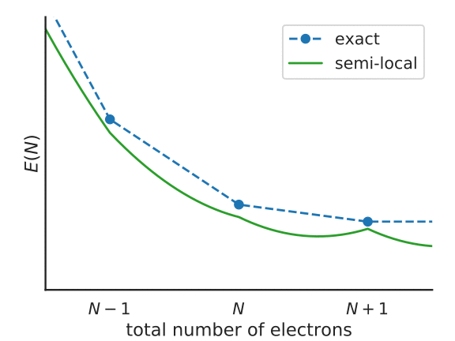

Koopmans functionals
====================

The motivating idea
-------------------

We saw from the previous section that DFT Kohn-Sham eigenvalues...

a. are not formally related to quasiparticle energies
b. suffer from self-interaction error

These two points inspire the design of Koopmans functionals. The key idea behind these functionals is that we desire a functional whose orbital\ [#]_ energies

.. math:: \varepsilon^\text{Koopmans}_i = \langle \varphi_i | H | \varphi_i \rangle = \frac{\partial E_\text{Koopmans}}{\partial f_i}

possess two key properties:

1. :math:`\varepsilon^\text{Koopmans}_i` is independent of the corresponding orbital occupancy :math:`f_i`

2. :math:`\varepsilon^\text{Koopmans}_i` is equal to the corresponding DFT total energy difference
   :math:`\Delta E^\text{Koopmans}_i` that corresponds to the addition/removal of an electron from the corresponding orbital :math:`i`
   
Property 1 means that we will be SIE-free, because the curvature of :math:`E_\text{Koopmans}` with respect to :math:`f_i` will be zero for every orbital :math:`i`. Meanwhile, property 2 is a necessary condition for piecewise linearity of the total energy. It also means that the quasiparticle energies are on much more stable theoretical footing, because they are expressly related to total energy differences, which are ground-state properties.

The functionals
---------------
So, finally, here is the Koopmans functional: 

.. math::

   E_\text{Koopmans} [\rho,
   {\{f_i\}}, {\{\alpha_i\}}]
   = {E_{DFT}[\rho]}
   + \sum_i
   {\alpha_i}
   \left(
   {- \int^{f_i}_{0} \varepsilon_i(f) df}
   {+ f_i \int_0^1 \varepsilon_i(f) df}
   \right)

The Koopmans functional is a corrective functional -- that is to say, we take some base DFT functional :math:`E_{DFT}` (typically a semi-local functional such as LDA or PBE), and we a corrective term. But what exactly is this corrective term? To understand where it comes from, consider the following figure

   Illustration of the Koopmans functional, term-by-term
   
The Koopmans functional starts with the energy given by the base functional :math:`E_{DFT}[\rho]` (point 1 in the above figure) from which we subtract :math:`\int^{f_i}_{0} \varepsilon_i(f) df` -- that is, the contribution of the erroneously-occupancy-dependent :math:`\varepsilon_i(f)` (point 2) -- and finally we add back in :math:`f_i \int_0^1 {\varepsilon_i(f)} df`, a term that is linear in :math:`f_i` (point 3).

The one final ingredient to discuss are the screening parameters :math:`\alpha_i`, that appear in the Koopmans energy functional as a multiplicative prefactor to the corrective term. In the above discussion where we removed the :math:`f`-dependence and replaced it with a linear term, we neglected the possibility of orbital relaxation: that is, as we empty and fill orbital :math:`i` the rest of the system will screen this process. These screening parameters account for this screening.

The end result is that :math:`E_\text{Koopmans}` is explicitly linear in :math:`f_i` and thus it satisfies property 1 by construction. As for property 2, the value of :math:`\varepsilon^\text{Koopmans}_i` is very clearly dependent on the screening parameters. We therefore choose our screening parameters in order to guarantee that these quasiparticle energies correspond to the desired total energy differences. We will discuss how exactly this is done :ref:`later <theory_screening>`.

----

.. [#] To be specific, by "orbitals" we mean the *variational* orbitals (explained :ref:`here <theory_vorbs_vs_corbs>`)
