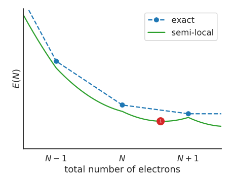
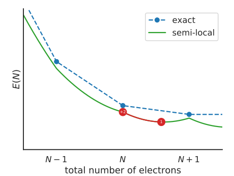
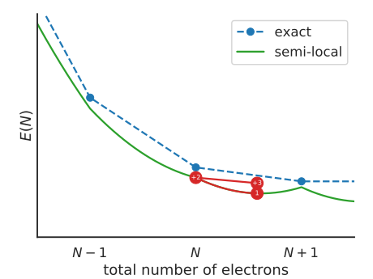

Koopmans functionals
====================

The motivating idea
-------------------

We saw from the previous section that DFT Kohn-Sham eigenvalues...

a. are not formally related to quasiparticle energies
b. suffer from self-interaction error

These two points inspired the design of Koopmans functionals. The key idea behind these functionals is that we desire a functional whose orbital energies

.. math:: \varepsilon^\mathsf{Koopmans}_i = \langle \varphi_i | H | \varphi_i \rangle = \frac{\partial E_\mathsf{Koopmans}}{\partial f_i}

possess two key properties:

1. they are independent of the corresponding occupancies :math:`f_i`

2. they are equal to the corresponding total energy difference
   :math:`E_i(N-1) - E(N)`

Property 1 means that we will be SIE-free, because the curvature of :math:`E_\mathsf{Koopmans}` with respect to :math:`f_i` will be zero for every orbital :math:`i`.

Meanwhile, property 2 means that the quasiparticle energies are on much more stable footing, because they are expressly related to a ground-state property.

The functionals
---------------
So, finally, here is the Koopmans functional: 

.. math::

   E_\mathsf{Koopmans} [\rho,
   {\{f_i\}}, {\{\alpha_i\}}]
   = {E_{DFT}[\rho]}
   + \sum_i
   {\alpha_i}
   \left(
   {- \int^{f_i}_{0} \varepsilon_i(f) df}
   {+ f_i \int_0^1 \varepsilon_i(f) df}
   \right)

This functional satisfies properties 1 and 2 by construction:

.. math::

   E_\mathsf{Koopmans}[\rho,{\{f_i\}}, \{\alpha_i\}] = E_{DFT}[\rho]
         + \sum_i
         \alpha_i
         \left(
         - \int^{f_i}_{0} \varepsilon_i(f) df
         + f_i \int_0^1 {\varepsilon_i(f)} df
         \right)

.. math::

   v^\mathrm{KI}_i/\alpha_i = - E_{\mathrm{H}}\left[n_{i}\right]
            + E_{\mathrm{xc}}\left[\rho\right]
            - E_{\mathrm{xc}}\left[\rho-n_{i}\right]
            - \int d\mathbf{r'}
            v_\mathrm{xc}(\mathbf{r}', [\rho])
            n_{i}(\mathbf{r}')

-  a natural generalisation in the direction of spectral functional
   theory