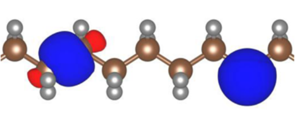
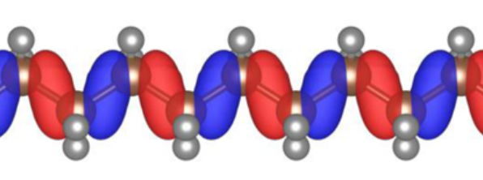

.. _theory_ingredients:

The key ingredients in a Koopmans calculation
=============================================

.. _theory_vorbs_vs_corbs:

The variational orbitals
------------------------
The one important distinction that is worth making right away is that Koopmans functionals are not a density functional, but an *orbital-density-dependent functional theory* (ODDFT). This is because in addition to being dependent on the total density :math:`\rho` it is also dependent on the individual occupancies. Indeed, each orbital will be subjected to a different potential, and when we solve a Koopmans functional we must minimise the total energy with respect to the entire set of orbitals as opposed to just the total density.

A further complication of ODDFTs is that we actually have *two* sets of orbitals that we must be careful to distinguish. The set of orbitals that minimise the total energy are the so-called *variational* orbitals. Because the leading term in an orbital's Koopmans potential is the negative of that orbital's self-Hartree energy, these variational orbitals tend to be very localised.

   Two variational orbitals of polyethylene. Figure taken from :cite:`Nguyen2018`

If we have minimised the total Koopmans energy we can then construct the Hamiltonian. If we then diagonalise this Hamiltonian we would obtain the so-called *canonical* orbitals. In a DFT framework, diagonalising the Hamiltonian would yield exactly the same orbitals that minimise the total energy. However, in an ODDFT, this is not the case, because the total energy is not invariant with respect to unitary rotations of a given set of orbitals, and thus the variational and canonical orbitals are different. In contrast to the variational orbitals, the canonical orbitals are typically very delocalised and much more closely resemble the Kohn-Sham orbitals of DFT. 

   A canonical orbital of polyethylene. Figure taken from :cite:`Nguyen2018`

Going from a DFT to and ODDFT may seem like a bothersome complication but actually it is a natural generalisation of DFT -- indeed, an ODDFT is in fact an energy-discretised spectral functional theory :cite:`Ferretti2014`.

.. _theory_screening:

The screening parameters
------------------------

Screening coefficients :math:`\{\alpha_i\}` must be determined first,

.. math::

   \frac{d E}{d f_i}
   \approx
   \alpha_i \frac{\partial E}{\partial f_i}
   \Longrightarrow \varepsilon_i^\mathsf{Koopmans} = \frac{\partial E_\mathsf{Koopmans}}{\partial f_i}  \approx E_i(N-1) - E(N)}

either (a) via :math:`\Delta`\ SCF calculations (using a supercell) or
(b) via DFPT (using a primitive cell)

:math:`\Delta E_i`, where :math:`\Delta E_i = E_i(N-1) - E(N)` for filled orbitals and :math:`\Delta E_i = E_i(N+1) - E(N)` for empty orbitals, and :math:`E_i(N\pm1)` is the total energy of the system where we add/remove an electron from orbital :math:`i` (and allow the rest of the electrons to relax).

.. _theory_dscf:

ΔSCF
^^^^

.. _theory_dfpt:

DFPT
^^^^

The flavour: KI, pKIPZ, or KIPZ
-------------------------------
KI vs KIPZ...