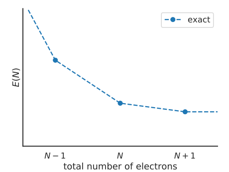
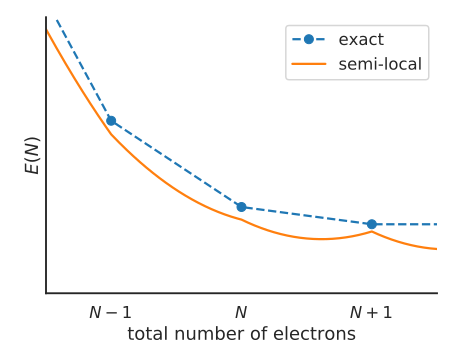
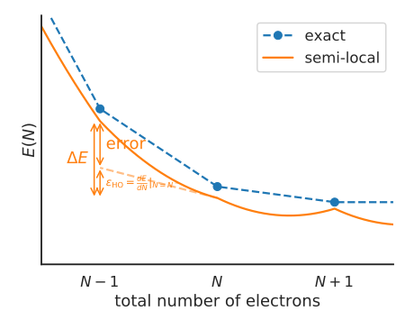
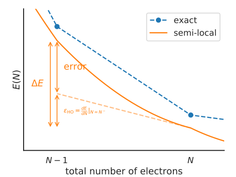
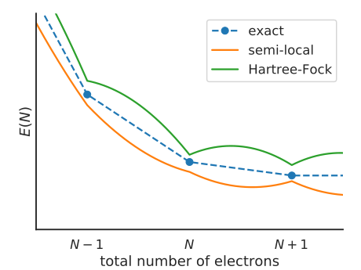

Quasiparticle energies, piecewise linearity, and Koopmans' theorem
==================================================================

Density functional theory (DFT) is a remarkably successful theory. However, its prediction of quasiparticle energies is very unreliable. Indeed, while the Kohn-Sham eigenvalues may loosely mirror experimental quasiparticle energies, there is formally no connection between the two (except for the HOMO in exact DFT, which is related to the decay of the density at large distances).

Furthermore, because DFT is an approximate theory the Kohn-Sham orbitals suffer from a few well-known errors, making them an even worse proxy for quasiparticle energies. Chief among these errors is "self-interaction error" (SIE).

DFT suffers from "one-body self-interaction error" because of the way it treats the Hartree term. For a wavefunction represented by a single Slater determinant, the Hartree term :math:`\Phi_i` felt by the i\ :sup:`th` particle is given by

.. math::

   \Phi_i(\mathbf{r}) = \sum_{i\neq j} \int d\mathbf{r}' \frac{|\psi_{n_j}(\mathbf{r}')|^2}{|\mathbf{r} - \mathbf{r}'|}
   
but in DFT we replace this orbital-dependent term with 

.. math::

    \Phi(\mathbf{r}) = \int d\mathbf{r}' \frac{\rho(\mathbf{r})}{\mathbf{r} - \mathbf{r'}}

which ignores the :math:`i \neq j` of the sum. This would be perfectly fine of the xc-functional perfectly cancelled this erroneously included self-Hartree term, but most xc-functionals do not, and consequently KS particles tend to over-delocalise in an attempt to minimise the Coulomb repulsion they feel from their own density.

More generally, DFT suffers from "many-body self-interaction error" (or "delocalisation error"). This manifests itself as an erroneous curvature in the total energy :math:`E(N)` of the system as a function of the total number of electrons :math:`N`.

Consequences for band gaps, densities, band structures, spectra...

How can we address self-interaction in a computationally efficient way? :math:`\longrightarrow` Koopmans spectral functionals
