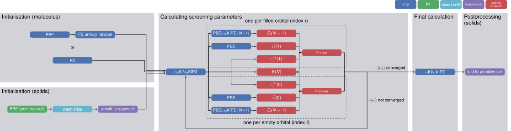
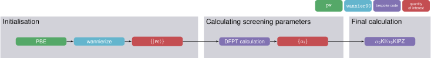

The Koopmans workflows
======================

These two methods for calculating the screening parameters leaves us with two different workflows for performing Koopmans calculations.

    
    Flowchart of the ΔSCF workflow (click to enlarge)

    
    The DFPT workflow (click to enlarge)
