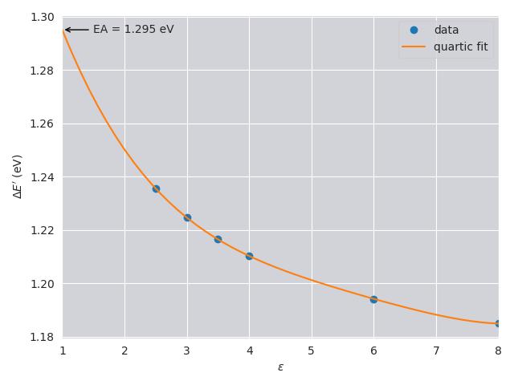

*********
Tutorials
*********
.. tip::
  Before beginning, download the `pseudopotentials <https://github.com/elinscott/python_KI/tree/master/pseudos>`_ and set the environment variable ``ESPRESSO_PSEUDO_DIR`` to wherever they're located on your machine

.. _tutorial1:

A simple KI calculation on an ozone molecule
============================================
In this tutorial, we will calculate the ionisation potential and electron affinity of ozone.

The input
---------

The input file for this calculation can be found in the repository under `examples/ozone/dscf/ozone.json <https://github.com/epfl-theos/koopmans/blob/master/examples/ozone/dscf/ozone.json>`_. Just to briefly highlight the most important details of the workflow block

.. literalinclude:: _static/tutorials/ozone/ozone.json
  :lines: 2-4
  :lineno-start: 2
  :emphasize-lines: 2

here we select the KI functional (as opposed to KIPZ),

.. literalinclude:: _static/tutorials/ozone/ozone.json
  :lines: 3-5
  :lineno-start: 3
  :emphasize-lines: 2

specifies that we are going to calculate the screening parameters via a ΔSCF procedure, whereby we compute the energies of various :math:`N`, :math:`N-1`, and :math:`N+1`-electron systems (see :ref:`the theory section<theory_dscf>` for details),

.. literalinclude:: _static/tutorials/ozone/ozone.json
  :lines: 4-6
  :lineno-start: 4
  :emphasize-lines: 2

specifies that our ozone molecule is not a periodic system, and

.. literalinclude:: _static/tutorials/ozone/ozone.json
  :lineno-start: 5
  :lines: 5-7
  :emphasize-lines: 2

specifies that we have chosen to use the Kohn-Sham orbitals as our :ref:`variational orbitals <theory_vorbs_vs_corbs>`. This is common practice for molecules.

Meanwhile, the ``setup`` block contains standard keywords specifying the system configuration, such as the ``cell_parameters``, ``atomic_positions``, and ``atomic_species``. If you are familiar with ``Quantum ESPRESSO`` input files then most of this should look very familiar to you (albeit in JSON format). The one keyword that will be unfamiliar is

.. literalinclude:: _static/tutorials/ozone/ozone.json
  :lines: 17-22
  :lineno-start: 18
  :emphasize-lines: 3-4

which tells ``kcp.x`` to perform a calculation including one empty orbital (which is necessary for obtaining the electron affinity).

Running the calculation
------------------------
In order to run the calculation, simply run

.. code-block:: bash

  koopmans ozone.json | tee ozone.out 

.. tip::
  In order to run in parallel, set the ``PARA_PREFIX`` environment variable to ``mpirun -np 4`` (or similar)

The output
----------
First, let us inspect the contents of ``ozone.out``: after the header we can see there are a list of Quantum ESPRESSO calculations that have been run by ``koopmans``. These come under three main headings.

Initialisation
^^^^^^^^^^^^^^
The first step in any Koopmans calculation is the initialisation step. In this step we initialise the density and the variational orbitals.

.. literalinclude:: _static/tutorials/ozone/ozone.out
  :language: text
  :lines: 15-21
  :lineno-start: 15

For this calculation we can see that ``koopmans`` has run three PBE calculations. These initialise the density with the PBE density. Indeed, from this point onwards in the calcuation the density will never change, because the KI functional yields the same density as the base functional. (N.B. This is not true of KIPZ.)

These PBE calculations also have provided us with our variational orbitals -- we can see that the calculation has selected the PBE Kohn-Sham orbitals as the variational orbitals (because earlier we set ``"init_orbitals": "kohn-sham"``).

But why three PBE calculations? The reason for this is that the calculations we will perform later involve the addition/removal of a single electron, which means the density we need to generate here must correspond to a ``nspin = 2`` calculation. However, we know ozone is a closed-shell molecule and simply performing a ``nspin = 2`` PBE calculation risks introducing spin contamination (i.e. falling into a local minimum where :math:`n^\uparrow(\mathbf{r}) \neq n^\downarrow(\mathbf{r})`).

This sequence of three calculations is designed to avoid this; we first optimise the density constrained to be spin-unpolarised, and only once that density has been minimised do we lift this restriction. This additional step can be disabled by adding ``"enforce_spin_symmetry": false`` to the ``workflow`` block of ``ozone.json``.

The input and output Quantum ESPRESSO files for this first step can all be found in the directory ``init/``.

Calculating the screening parameters
^^^^^^^^^^^^^^^^^^^^^^^^^^^^^^^^^^^^
The second step in the calculation involves the calculation of the screening parameters:

.. literalinclude:: _static/tutorials/ozone/ozone.out
  :language: text
  :lines: 22-40
  :lineno-start: 22

etc. Here, we are calculating the screening parameters using the :ref:`ΔSCF method <theory_dscf>`. For filled orbitals (orbitals 1-9 of ozone) this requires three calculations

.. collapse:: Click here for detailed descriptions of each calculation

  ki_frozen
    a KI calculation where the density and variational orbitals are fixed. This yields :math:`\lambda_{ii}^\alpha(1)`  
  
  dft_frozen
    a KI calculation where the density and variational orbitals are fixed. This yields :math:`\lambda_{ii}^0(1)`
  
  dft_n-1
    a :math:`N-1`-electron PBE calculation where we freeze the i\ :sup:`th` orbital, empty it, and allow the rest of the density to relax. This yields :math:`E_i(N-1)`
  
  Together with :math:`E(N)` (a result that is given by ``calc_alpha/ki``) and the value of our guess for the screening parameters (:math:`\alpha^0_i = 0.6`), this is sufficient to update our guess for :math:`\alpha_i` (see the :ref:`theory section <theory_dscf>` for details).

|

The procedure for empty orbitals is slightly different, as we can see when it comes to orbital 10:

.. literalinclude:: _static/tutorials/ozone/ozone.out
  :language: text
  :lines: 81-87
  :lineno-start: 81

where now we have a slightly different set of calculations

.. collapse:: Click here for detailed descriptions of each calculation

  pz_print and dft_n+1_dummy
    preliminary calculations that generate files required by the subsequent calculations
  
  dft_n+1
    a :math:`N+1`-electron PBE calculation where we freeze the 10\ :sup:`th` orbital, fill it, and allow the rest of the density to relax. This yields :math:`E_i(N+1)`
  
  dft_n+1-1_frozen
    a :math:`N`-electron PBE calculation where the density and variational orbitals are frozen. This yields :math:`\lambda_{ii}^0(0)`
  
  ki_n+1-1_frozen
    a :math:`N`-electron KI calculation where the density and variational orbitals are frozen. This yields  :math:`\lambda_{ii}^\alpha(0)`

|

At the end of this section we can see a couple of tables:

.. literalinclude:: _static/tutorials/ozone/ozone.out
  :language: text
  :lines: 90-102
  :lineno-start: 90

The first table lists the screening parameters :math:`\alpha_i` that we obtained -- we can see from row 0 we started with a guess of :math:`\alpha_i = 0.6` for every orbital `i`, and row 1 shows the alpha values.

The second table lists :math:`\Delta E_i - \lambda_{ii}^\alpha`. This is a measure of how well converged the alpha values are: if this value is close to zero, then the alpha values are well-converged. Note that the values listed above correspond to our starting guess of :math:`\alpha_i = 0.6`; this table does not show how well-converged the final alpha values are.

.. note::
  In order to see how well-converged our new screening parameters are, try increasing ``n_max_sc_steps`` in the input file from ``1`` to ``2``. Can you make sense of the contents of the resulting tables?

The input and output Quantum ESPRESSO files for this step can be found in the directory ``calc_alpha/``.

The final calculation
^^^^^^^^^^^^^^^^^^^^^
Having determined the screening parameters, the final KI calculation is now run:

.. literalinclude:: _static/tutorials/ozone/ozone.out
  :language: text
  :lines: 103-105
  :lineno-start: 103

The input and output Quantum ESPRESSO files for this step can be found in the directory ``final/``.

Extracting the ionisation potential and electron affinity
---------------------------------------------------------
Let's now extract the KI ionisation potential and electron affinity for ozone from our calculation.

The ionisation potential (IP) corresponds to the negative of the energy of the HOMO (highest occupied molecular orbital). If you open ``final/ki_final.cpo`` and search near the bottom of the file you will see a section something like

.. code-block:: text

  ...
  HOMO Eigenvalue (eV)

  -12.5199

  LUMO Eigenvalue (eV)

  -1.8218

  Eigenvalues (eV), kp =   1 , spin =  1

  -40.1869  -32.9130  -24.2288  -19.6841  -19.4902  -19.2696  -13.6037  -12.7618  -12.5199

  Empty States Eigenvalues (eV), kp =   1 , spin =  1

  -1.8218

  Electronic Gap (eV) =    10.6981

  Eigenvalues (eV), kp =   1 , spin =  2

  -40.1869  -32.9130  -24.2288  -19.6841  -19.4902  -19.2696  -13.6037  -12.7618  -12.5199

  Empty States Eigenvalues (eV), kp =   1 , spin =  2

  -1.8218

  Electronic Gap (eV) =    10.6981
  ...

Very clearly we can see the HOMO eigenvalue of -12.52 eV. Thus we have a KI IP of 12.52 eV. This compares extremely well to the `experimental value <https://webbook.nist.gov/cgi/cbook.cgi?ID=C10028156&Mask=20#Ion-Energetics>`_ of ~ 12.5 eV, and is a marked improvement on the PBE result of 7.95 eV (which we can obtain from the ``HOMO Eigenvalue`` in ``init/dft_init_nspin2.cpo``).

Meanwhile, the electron affinity (EA) corresponds to the negative of the energy of the LUMO (lowest unoccupied molecular orbital). From the same section in ``final/ki_final.cpo`` we can see that the KI EA is 1.82 eV (cf. ~ 2.1 eV experiment, 6.17 eV PBE)

.. tip::
  If you prefer working within ``python``, you need not write a script to parse the contents of ``final/ki_final.cpo`` in order to extract the IP and EA. Instead, ``koopmans`` will have generated a python-readable file ``ozone.kwf`` containing all of the important calculation data.

  You can read these files like so:

  .. literalinclude:: _static/tutorials/ozone/read.py

  Indeed, it is also possible to run the workflow rom within ``python`` (rather than calling ``koopmans`` from the command line)

  .. literalinclude:: _static/tutorials/ozone/run.py

  in which case you have immediate access to the workflow object ``wf`` rather than having to load in the ``.kwf`` file.

A simple KI calculation on bulk silicon
=======================================
In this tutorial, we will calculate the KI bandstructure of bulk silicon. The input file used for this calculation can be found here.

.. literalinclude:: _static/tutorials/si.json
  :linenos:

Convergence testing
===================
In this tutorial, we will make use of the ``convergence`` task to determine how large a cell size and energy cutoff is required to converge the PBE energy of the highest occupied molecular orbital (HOMO) of a water molecule. In order to do this, our ``workflow`` block needs a few particular keywords:

.. literalinclude:: _static/tutorials/pbe_convergence.json
  :lines: 1-11
  :linenos:
  :emphasize-lines: 5, 7-9

The important lines are highlighted. ``"task": "convergence"`` means that we will be performing a convergence test. The other three highlighted keywords specifying that we are going to converge the HOMO energy to within 0.01 eV, with respect to *both* the energy cutoff ``ecutwfc`` and the cell size. The full input file can be found `here <https://raw.githubusercontent.com/elinscott/koopmans_docs/main/_static/tutorials/pbe_convergence.json>`_.

When you run the calculation you should get something like this:

.. code-block:: text

  $ koopmans pbe_convergence.json
  ecutwfc = 20.0, cell_size = 1.0
  Running pbe... done
  
  ecutwfc = 20.0, cell_size = 1.1
  Running pbe... done
  
  ecutwfc = 20.0, cell_size = 1.2
  Running pbe... done
  
  ...
  
  ecutwfc = 60.0, cell_size = 1.4
  Running pbe... done
  
  Converged parameters are ecutwfc = 50.0, cell_size = 1.3

The code progressively tries higher and higher energy cutoffs, as well as larger and larger cells, until it arrives at the converged solution, with a ``ecutwfc`` of 50.0 Ha and a cell 1.3 times larger than that provided in the ``.json`` input file.

The individual calculations reside in nested subdirectories. If you plot the HOMO energies from each of these, this is what you will get:

.. image:: _static/tutorials/pbe_convergence_plot.png
  :width: 800
  :alt: Plot of HOMO energy with respect to ecutwfc and cell size
  :align: center

and we can see that indeed the calculation with ``ecutwfc = 50.0`` and ``cell_size = 1.3`` is the one where the energy of the HOMO goes within (and stays within) 0.01 eV of the most accurate calculation.

Calculating electron affinities for small anions
================================================
.. tip:: To run this tutorial, you will need a version of ``pw.x`` with the `environ <https://environ.readthedocs.io/en/latest/>`_ patch installed.

The ``koopmans`` package can also calculate the PBE electron affinities of small molecules using the method of Nattino *et al.*. These anions are typically unbound (wrongly) by PBE, which means we cannot perform a standard ΔSCF calculation. Instead, the molecule is embedded within a cavity and finite difference calculations are performed with increasingly small values of :math:`\varepsilon_\infty`. See :cite:`Nattino2019` for a more detailed description.

Running these calculations is enabled with the ``environ_dscf`` task, and ``eps_cavity`` is a list of the trial values of :math:`\varepsilon_\infty` to use e.g.

.. literalinclude:: _static/tutorials/o2_environ_dscf.json
  :lines: 2-5
  :linenos:

The full input file can be downloaded `here <https://raw.githubusercontent.com/elinscott/koopmans_docs/main/_static/tutorials/o2_environ_dscf.json>`_. When you run this calculation, the output will be as follows:

.. code-block:: text

  $ koopmans o2_environ_dscf.json
  PBE ΔSCF WORKFLOW

  Performing neutral calculations...
  Running neutral/8/pbe... done
  Running neutral/6/pbe... done
  Running neutral/4/pbe... done
  Running neutral/3.5/pbe... done
  Running neutral/3/pbe... done
  Running neutral/2.5/pbe... done
  Running neutral/2/pbe... done
  Running neutral/1/pbe... done

  Performing charged calculations...
  Running charged/8/pbe... done
  Running charged/6/pbe... done
  Running charged/4/pbe... done
  Running charged/3.5/pbe... done
  Running charged/3/pbe... done
  Running charged/2.5/pbe... done
  Running charged/2/pbe... failed to converge

  WORKFLOW COMPLETE

so we can see that for :math:`\varepsilon_\infty = 2` the anion became unstable, as expected. If we perform a quartic fit to the energies (following the example of Nattino *et al.*) we can extrapolate back to :math:`\varepsilon_\infty = 1` to obtain the electron affinity of 1.30 eV.

.. warning::
  The `koopmans` implementation of this workflow differs from Nattino *et al.* in one major aspect: we use the same atomic positions for the anion as the neutral molecule. This means that we obtain *vertical* rather than *adiabatic* electron affinities. The reason for this choice is to be consistent with Koopmans spectral functionals, whose LUMO energies correspond to vertical electron affinities.
