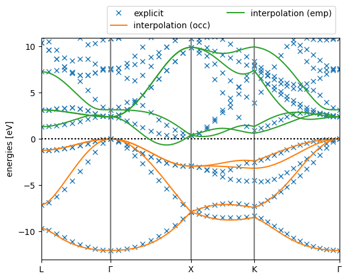

Tutorial 2: a simple KI calculation on bulk silicon
===================================================
In this tutorial, we will calculate the KI bandstructure of bulk silicon. The input file used for this calculation can be downloaded here :download:`here <tutorial_2/si.json>`.

Wannierisation
--------------
There are two main differences between performing a Koopmans calculation on a bulk system vs. a molecule (as we did in tutorial 1). The first difference is that we use Wannier functions as our variational orbitals.

What are Wannier functions?
^^^^^^^^^^^^^^^^^^^^^^^^^^^
Most electronic-structure codes try to calculate the Bloch states :math:`\psi_{n\mathbf{k}}` of periodic systems (where :math:`n` is the band index and :math:`\mathbf{k}` the crystal momentum). However, other representations are equally valid. One such representation is the Wannier function (WF) basis. In contrast to the very delocalised Bloch states, WFs are spatially localised and as such represent a very convenient basis to work with for many applications. For our case, the fact that they are localised means that they are suitable for use as variational orbitals.

Wannier functions :math:`w_{n\mathbf{R}}(\mathbf{r})` can be written in terms of a transformation of the Bloch states:

.. math::

  \begin{equation}
  w_{n \mathbf{R}}(\mathbf{r})
  =\frac{V}{(2 \pi)^{3}}
  \int_{\mathrm{BZ}}
  \left[
    \sum_{m} U_{m n}^{(\mathbf{k})} \psi_{m \mathbf{k}}(\mathbf{r})
  \right]
  e^{-i \mathbf{k}\cdot \mathbf{R}}
  \mathrm{d} \mathbf{k}
  \end{equation}

where our Wannier functions belong to a particular lattice site :math:`\mathbf{R}`, :math:`V` is the unit cell volume, the integral is over the Brillouin zone (BZ), and :math:`U^{(\mathbf{k})}_{mn}` defines a unitary rotation that mixes the Bloch states with crystal momentum :math:`\mathbf{k}`. Crucially, this matrix is not uniquely defined -- indeed, it represents a freedom of the transformation that we can exploit.

We choose our :math:`U^{(\mathbf{k})}_{mn}` that gives rise to WFs that are "maximially localised". We quantify the spread :math:`\Omega` of a WF as

.. math::

  \begin{equation}
  \Omega=
  \sum_{n}
  \left[
    \left\langle w_{n \mathbf{0}}(\mathbf{r}) \right|
    r^{2}
    \left| w_{n \mathbf{0}}(\mathbf{r})\right\rangle
    -
    \left|
    \left\langle w_{n \mathbf{0}}(\mathbf{r})\right|
    \mathbf{r}
    \left| w_{n \mathbf{0}}(\mathbf{r})\right\rangle
    \right|^{2}
    \right]
  \end{equation}

The Wannier functions that minimise this spread are called maximally localised Wannier functions (MLWFs). For more details, see Ref. :cite:`Marzari2012`.

How do I calculate Wannier functions?
^^^^^^^^^^^^^^^^^^^^^^^^^^^^^^^^^^^^^
MLWFs can be calculated with `Wannier90 <http://www.wannier.org/>`_, an open-source code that is distributed with ``Quantum ESPRESSO``.

.. note::

  This tutorial will not discuss in detail how perfrom a Wannierisation with Wannier90. The Wannier90 website contains lots of good `tutorials <http://www.wannier.org/support/>`_ on this topic.

  The one important distinction to make for Koopmans calculations -- as opposed to many of the Wannier90 tutorials -- is that we need to separately Wannierise the occupied and empty manifolds.

Performing a Wannierisation with Wannier90 requires a series of calculations to be performed with ``pw.x``, ``wannier90.x``, and ``pw2wannier90.x``. This workflow is automated within ``koopmans``, as we will see in this tutorial. Let's now inspect this tutorial's :download:`input file <tutorial_2/si.json>`. At the top you will see that

.. literalinclude:: tutorial_2/si.json
  :lines: 2-4
  :lineno-start: 2
  :emphasize-lines: 2

which tells the code to perform a standalone Wannierisation calculation. Meanwhile, at the bottom of the file there are some Wannier90-specific parameters provided in the ``w90`` block

.. literalinclude:: tutorial_2/si.json
  :lines: 84-103
  :lineno-start: 84

Here, the keywords provided in the ``emp`` subdictionary are only applied during the Wannierisation of the empty manifold. The ``w90`` block format is explained more fully :ref:`here <The w90 block>`.

We run this calculation as per usual:

.. code-block:: bash

  koopmans si.json | tee si.out

After the usual header, you should see something like the following:

.. literalinclude:: tutorial_2/si_wannierise.out
  :lines: 15-27

These various calculations that are required to obtain the MLWFs of bulk silicon. You can inspect the  and various output files will have been generated in a new ``wannier/`` directory.

.. collapse:: Click here for detailed descriptions of each calculation

  scf
    a ``pw.x`` self-consistent DFT calculation performed with no empty bands. This obtains the ground-state electronic density

  nscf
    a ``pw.x`` non-self-consistent DFT calculation that determines the Hamiltonian, now including some empty bands

  occ/wann_preproc
    a preprocessing ``wannier90.x`` calculation that generates some files required by ``pw2wannier90.x``

  occ/pw2wan
    a ``pw2wannier90.x`` calculation that extracts from the eariler ``pw.x`` calculations several key quantities required for generating the Wannier orbitals for the occupied manifold: namely, the overlap matrix of the cell-periodic part of the Block states (this is the ``wann.mmn`` file) and the projection of the Bloch states onto some trial localised orbitals (``wann.amn``)

  occ/wann
    the ``wannier90.x`` calculation that obtains the MLWFs for the occupied manifold

  emp/...
    the analogous calculations as those in ``occ/``, but for the empty manifold
  
  bands
    a ``pw.x`` calculation that calculates the band structure of silicon explicitly, used for verification of the Wannierisation (see the next section)

|

The main output files of interest in ``wannier/`` are files ``occ/wann.wout`` and ``emp/wann.wout``, which contain the output of ``wannier90.x`` for the Wannierisation of the occupied and empty manifolds. If you inspect ``wannier/occ/wann.wout`` you will be able to see a lot of starting information, and then under a heading like

.. code-block::

  *------------------------------- WANNIERISE ---------------------------------*
  +--------------------------------------------------------------------+<-- CONV
  | Iter  Delta Spread     RMS Gradient      Spread (Ang^2)      Time  |<-- CONV
  +--------------------------------------------------------------------+<-- CONV

you will then see a series of steps where you can see the Wannier functions being optimised and the spread (labelled ``SPRD``) decreasing from one step to the next. Scrolling down further you should see a statement that the Wannierisation procedure has converged, alongside with a summary of the final state of the WFs.

How do I know if the Wannier functions I have calculated are "good"?
^^^^^^^^^^^^^^^^^^^^^^^^^^^^^^^^^^^^^^^^^^^^^^^^^^^^^^^^^^^^^^^^^^^^
Performing a Wannierisation calculation is not a straightforward procedure, and requires the tweaking of the Wannier90 input parameters in order to obtain a "good" set of Wannier functions.

One good check is to see if an interpolated bandstructure generated by the MLWFs resembles an explicitly-calculated band structure. You might have noticed that ``koopmans`` also generated a file called ``interpolated_bandstructure_2x2x2.png``. It should look something like this:

  Comparing the interpolated and explicitly-calculated band structures of bulk silicon

Clearly, we can see that the interpolation is no good! (The interpolated band structure ought to lie on top of the explicitly calculated band structure.) The reason for this is that the Brillouin zone is undersampled by our :math:`2\times2\times2` :math:`k`-point grid. Try increasing the size of the k-point grid and see if the interpolated bandstructure improves.

.. tip::

  Trying different grid sizes can be very easily automated within ``python``. Here is a simple script that will run the Wannierisation for three different grid sizes:

  .. literalinclude:: tutorial_2/wannierise.py

TODO: add discussion of real/imaginary ratio of WFs

The KI calculation
------------------
Having obtained a Wannierisation of silicon that we are happy with, we can proceed with the KI calculation. In order to do this simply change the ``task`` argument from ``wannierise`` to ``singlepoint``.

.. tip::

  Although we just discovered that a :math:`2\times2\times2` :math:`k`-point grid was inadequate for producing good Wannier functions, this next calculation is a lot more computationally intensive and will take a long time on most desktop computers. We therefore suggest that for the purposes of going through this tutorial you switch back to the small :math:`k`-point grid. (But for any proper calculations, always use high-quality Wannier functions!)

If you run this new input the output will be remarkably similar to that from the previous tutorial, with a couple of exceptions. At the start of the workflow you will see there is a Wannierisation procedure, much like we had earlier when we running with the ``wannierise`` task:

.. literalinclude:: tutorial_2/si_ki.out
  :lines: 15-34
  :lineno-start: 15
  :language: text

which replaces the previous series of semi-local and PZ calculations that we used to initialise the variational orbitals for a molecule.

There is then an new "folding to supercell" subsection:

.. literalinclude:: tutorial_2/si_ki.out
  :lines: 29-32
  :lineno-start: 29
  :language: text

The subsequent ΔSCF calculations, where we remove/add an electron from/to the system, require us to work in a supercell. These ``wan2odd`` calculations involve transforming the :math:`k`-dependent primitive cell results from previous calculuations into equivalent :math:`\Gamma`-only supercell quantities that can be read by ``kcp``.

The calculation of the screening parameters proceeds as usual. The one difference you might notice here is that we are skipping the calculation of screening parameters for some of the orbitals e.g.

.. literalinclude:: tutorial_2/si_ki.out
  :lines: 36-46
  :lineno-start: 36
  :emphasize-lines: 7
  :language: text

The code is doing this because of what we provided for the ``orbital_groups`` in the input file:

insert input file lines here

The final difference is there is an additional preprocessing step:

.. literalinclude:: tutorial_2/si_ki.out
  :lines: 82-85
  :lineno-start: 82
  :language: text
